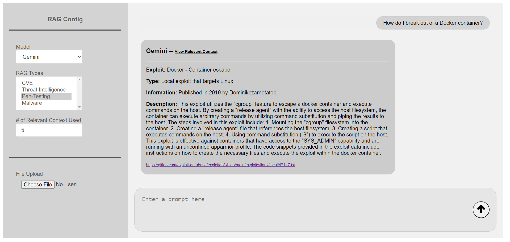

<h1 align="center"> RAG App </h1>

  

## Overview

We've developed an application that lets you use all the Cyber Science Lab RAGs (Retrieval-Augmented Generation) from one platform. At the current time there are 4 RAGs available: Penetration Testing, CVE, Malware and Threat Intelligence. The process works by processing the user requests and retrieving context based on the selected RAG model and then uses the chosen LLM (Large Language Model) to generate accurate responses. The frontend allows you to select the LLM model, configure RAG settings, upload files, and view the results in real-time, making it easy to work with our cybersecurity RAGs and get the information you need.

Learn more about how to use our RAG App from our [document](assets/Interacting_With_The_RAG_UI.pdf).

For a more interactive learning experience, check out our YouTube video
[**Interacting with the RAG UI**](https://youtu.be/B7ptWWPZ3iE?si=XzrXmu22UH7bVOuA).

## Examples

#

  

